Viz day 2
================
Miriam Lachs
2024-10-01

import weather data

``` r
weather_df = 
  rnoaa::meteo_pull_monitors(
    c("USW00094728", "USW00022534", "USS0023B17S"),
    var = c("PRCP", "TMIN", "TMAX"), 
    date_min = "2021-01-01",
    date_max = "2022-12-31") |>
  mutate(
    name = case_match(
      id, 
      "USW00094728" ~ "CentralPark_NY", 
      "USW00022534" ~ "Molokai_HI",
      "USS0023B17S" ~ "Waterhole_WA"),
    tmin = tmin / 10,
    tmax = tmax / 10) |>
  select(name, id, everything())
```

    ## using cached file: /Users/miriamlachs/Library/Caches/org.R-project.R/R/rnoaa/noaa_ghcnd/USW00094728.dly

    ## date created (size, mb): 2024-09-26 10:17:45.265429 (8.651)

    ## file min/max dates: 1869-01-01 / 2024-09-30

    ## using cached file: /Users/miriamlachs/Library/Caches/org.R-project.R/R/rnoaa/noaa_ghcnd/USW00022534.dly

    ## date created (size, mb): 2024-09-26 10:17:49.802518 (3.932)

    ## file min/max dates: 1949-10-01 / 2024-09-30

    ## using cached file: /Users/miriamlachs/Library/Caches/org.R-project.R/R/rnoaa/noaa_ghcnd/USS0023B17S.dly

    ## date created (size, mb): 2024-09-26 10:17:51.276215 (1.036)

    ## file min/max dates: 1999-09-01 / 2024-09-30

make a scatter plot and fancy this time

``` r
weather_df %>% 
  ggplot(aes(x=tmin, y=tmax,colour = name))+
  geom_point(alpha =.3)+
  labs(
    title = "Temp Scatterplot",
    x = 'Minimum Temp (C)',
    y= 'MAximum Temp (C)',
    color = 'Location',
    caption = 'Weather data taken from rnoaa package from three stations'
  )
```

    ## Warning: Removed 17 rows containing missing values or values outside the scale range
    ## (`geom_point()`).

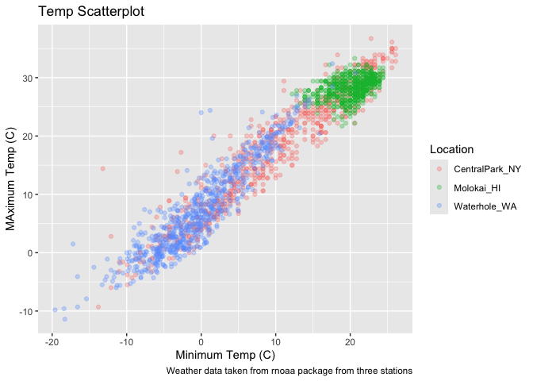<!-- -->

Scales – start with ‘x’ and ‘y’ then do color

``` r
weather_df %>% 
  ggplot(aes(x=tmin, y=tmax,colour = name))+
  geom_point(alpha =.3)+
  labs(
    title = "Temp Scatterplot",
    x = 'Minimum Temp (C)',
    y= 'MAximum Temp (C)',
    color = 'Location',
    caption = 'Weather data taken from rnoaa package from three stations'
  )+ 
  scale_x_continuous(
    breaks = c(15,0,20),
    labels = c('-15C','0','20')
  )+
  scale_y_continuous(
    limits = c(0,30),
    transform = 'sqrt'
  )
```

    ## Warning in transformation$transform(x): NaNs produced

    ## Warning in scale_y_continuous(limits = c(0, 30), transform = "sqrt"): sqrt
    ## transformation introduced infinite values.

    ## Warning: Removed 302 rows containing missing values or values outside the scale range
    ## (`geom_point()`).

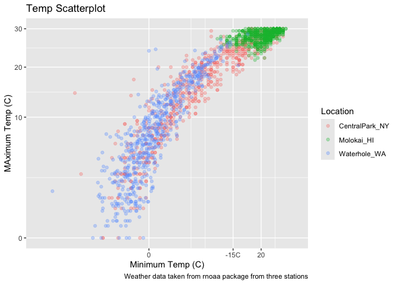<!-- -->

Look at color

``` r
weather_df %>% 
  ggplot(aes(x=tmin, y=tmax,colour = name))+
  geom_point(alpha =.3)+
  labs(
    title = "Temp Scatterplot",
    x = 'Minimum Temp (C)',
    y= 'MAximum Temp (C)',
    color = 'Location',
    caption = 'Weather data taken from rnoaa package from three stations'
  )+ viridis::scale_color_viridis(discrete = TRUE)
```

    ## Warning: Removed 17 rows containing missing values or values outside the scale range
    ## (`geom_point()`).

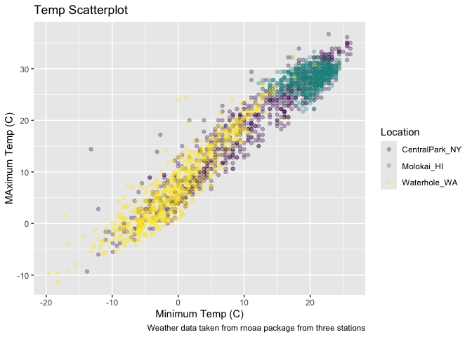<!-- -->

## Themes

``` r
ggp_scallterplot=
  weather_df %>% 
  ggplot(aes(x=tmin, y=tmax,colour = name))+
  geom_point(alpha =.3)+
  labs(
    title = "Temp Scatterplot",
    x = 'Minimum Temp (C)',
    y= 'MAximum Temp (C)',
    color = 'Location',
    caption = 'Weather data taken from rnoaa package from three stations'
  )+ viridis::scale_color_viridis(discrete = TRUE)
```

``` r
ggp_scallterplot +
  theme(legend.position = 'bottom')
```

    ## Warning: Removed 17 rows containing missing values or values outside the scale range
    ## (`geom_point()`).

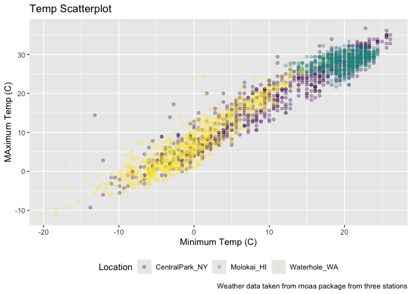<!-- -->

``` r
ggp_scallterplot+
  theme_bw()+
  theme(legend.position = 'bottom')
```

    ## Warning: Removed 17 rows containing missing values or values outside the scale range
    ## (`geom_point()`).

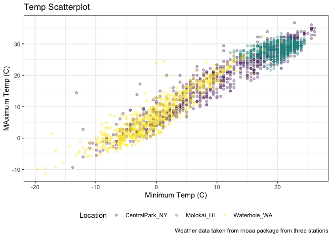<!-- -->

order matters

``` r
ggp_scallterplot +
  theme(legend.position = 'bottom')+
  theme_bw()
```

    ## Warning: Removed 17 rows containing missing values or values outside the scale range
    ## (`geom_point()`).

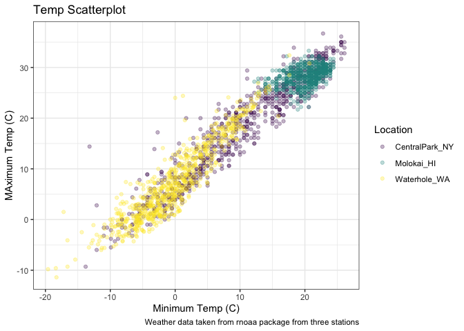<!-- -->

``` r
ggp_scallterplot+
  theme_minimal()+
  theme(legend.position = 'bottom')
```

    ## Warning: Removed 17 rows containing missing values or values outside the scale range
    ## (`geom_point()`).

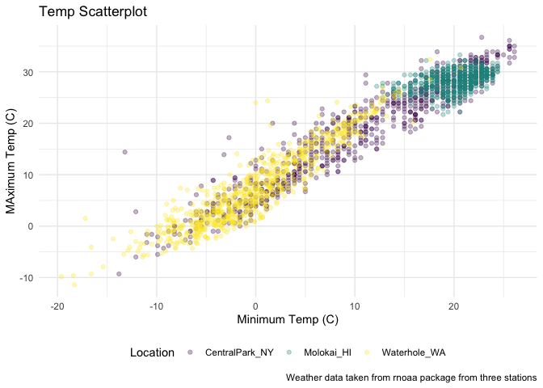<!-- -->

learnng assesment

``` r
weather_df %>% 
  ggplot(aes(x=date,y=tmax,colour = name))+
  geom_point(alpha=.3)+
  geom_smooth(se=FALSE)+
  labs(x = 'Date', 
       y = 'Maximum Temp (C)',
       title = 'Sasonal Variation in Max Temp')+
  viridis::scale_color_viridis(discrete = TRUE)+
  theme_minimal()+
  theme(legend.position = 'bottom')
```

    ## `geom_smooth()` using method = 'loess' and formula = 'y ~ x'

    ## Warning: Removed 17 rows containing non-finite outside the scale range
    ## (`stat_smooth()`).

    ## Warning: Removed 17 rows containing missing values or values outside the scale range
    ## (`geom_point()`).

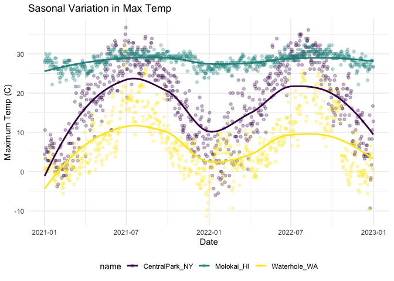<!-- -->

extra bonus stuff in ggplot

use different data sets in different geoms

``` r
cental_park_df = 
  weather_df %>% 
  filter(name=='CentralPark_NY')

molokai_df=
  weather_df %>% 
  filter(name=='Molokai_HI')

molokai_df %>% 
  ggplot(aes(x=date,y=tmax, color = name))+
  geom_point()+
  geom_line(data=cental_park_df)
```

    ## Warning: Removed 1 row containing missing values or values outside the scale range
    ## (`geom_point()`).

<!-- -->

multiple panals

``` r
weather_df %>% 
  ggplot(aes(x=tmax,fill = name))+
  geom_density()+
  facet_grid(.~name)
```

    ## Warning: Removed 17 rows containing non-finite outside the scale range
    ## (`stat_density()`).

<!-- -->

``` r
ggp_tmax_tmin =
  weather_df %>% 
  ggplot(aes(x=tmin,y=tmax,color=name))+
  geom_point(alpha=.3)

ggp_tmax_density =
  weather_df %>% 
  ggplot(aes(x=tmax,,fill=name))+
  geom_density(alpha=.3)

ggp_tmax_date_p = 
  weather_df |> 
  ggplot(aes(x = date, y = tmax, color = name)) + 
  geom_point(alpha = .5) +
  geom_smooth(se = FALSE) + 
  theme(legend.position = "bottom")
(ggp_tmax_tmin+ggp_tmax_density)/ggp_tmax_date_p
```

    ## Warning: Removed 17 rows containing missing values or values outside the scale range
    ## (`geom_point()`).

    ## Warning: Removed 17 rows containing non-finite outside the scale range
    ## (`stat_density()`).

    ## `geom_smooth()` using method = 'loess' and formula = 'y ~ x'

    ## Warning: Removed 17 rows containing non-finite outside the scale range
    ## (`stat_smooth()`).

    ## Warning: Removed 17 rows containing missing values or values outside the scale range
    ## (`geom_point()`).

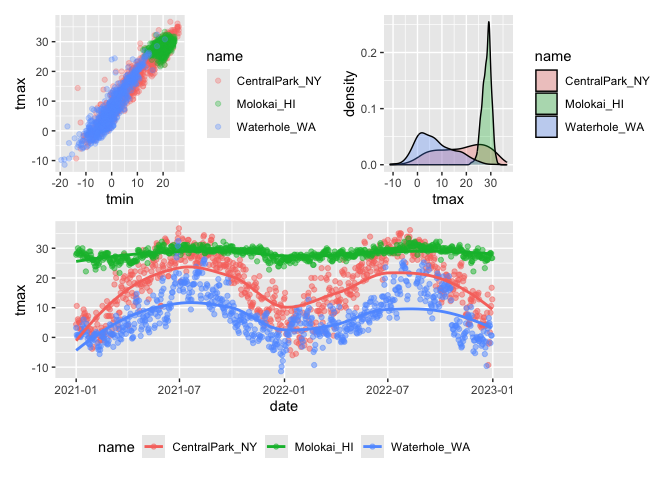<!-- -->

## Data manipulation

``` r
weather_df %>% 
  mutate(name=fct_relevel(name, c('Molokai_HI','CentralPark_NY','Waterhole_WA'))) %>% 
  ggplot(aes(x=name,y=tmax,fill = name))+
  geom_violin(alpha=.5)
```

    ## Warning: Removed 17 rows containing non-finite outside the scale range
    ## (`stat_ydensity()`).

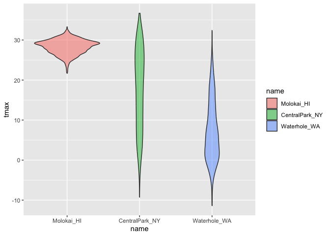<!-- -->

PULSE data next

``` r
pulse_df=
  read_sas('data_import_examples/public_pulse_data.sas7bdat') %>% 
  janitor::clean_names() %>% 
  pivot_longer(names_to = "visit",cols = 'bdi_score_bl':'bdi_score_12m',values_to = 'bdi_score',names_prefix = "bdi_score_") %>% 
  mutate(visit= ifelse(visit=='bl','00m',visit))

pulse_df%>% 
  ggplot(aes(x=visit,y=bdi_score))+
  geom_boxplot()
```

    ## Warning: Removed 879 rows containing non-finite outside the scale range
    ## (`stat_boxplot()`).

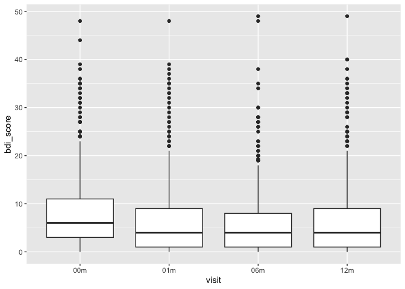<!-- -->

learning assesment FAS

``` r
FAS_litters_df= 
  read_csv('data_import_examples/FAS_litters.csv') %>% 
  janitor::clean_names() %>%
  separate(group, into = c("dose", "treat_day"), sep = 3)
```

    ## Rows: 49 Columns: 8
    ## ── Column specification ────────────────────────────────────────────────────────
    ## Delimiter: ","
    ## chr (4): Group, Litter Number, GD0 weight, GD18 weight
    ## dbl (4): GD of Birth, Pups born alive, Pups dead @ birth, Pups survive
    ## 
    ## ℹ Use `spec()` to retrieve the full column specification for this data.
    ## ℹ Specify the column types or set `show_col_types = FALSE` to quiet this message.

``` r
FAS_pups_df=
  read_csv('data_import_examples/FAS_pups.csv') %>% 
  janitor::clean_names()
```

    ## Rows: 313 Columns: 6
    ## ── Column specification ────────────────────────────────────────────────────────
    ## Delimiter: ","
    ## chr (2): Litter Number, PD ears
    ## dbl (4): Sex, PD eyes, PD pivot, PD walk
    ## 
    ## ℹ Use `spec()` to retrieve the full column specification for this data.
    ## ℹ Specify the column types or set `show_col_types = FALSE` to quiet this message.

``` r
FAS_df=
  FAS_litters_df %>% 
  full_join(FAS_pups_df,join_by(litter_number==litter_number))
```

``` r
litter_data = 
  read_csv("data_import_examples//FAS_litters.csv", na = c("NA", ".", "")) |>
  janitor::clean_names() |>
  separate(group, into = c("dose", "day_of_tx"), sep = 3)
```

    ## Rows: 49 Columns: 8
    ## ── Column specification ────────────────────────────────────────────────────────
    ## Delimiter: ","
    ## chr (2): Group, Litter Number
    ## dbl (6): GD0 weight, GD18 weight, GD of Birth, Pups born alive, Pups dead @ ...
    ## 
    ## ℹ Use `spec()` to retrieve the full column specification for this data.
    ## ℹ Specify the column types or set `show_col_types = FALSE` to quiet this message.

``` r
pup_data = 
  read_csv("data_import_examples//FAS_pups.csv", na = c("NA", ".", "")) |>
  janitor::clean_names() %>% 
  pivot_longer(cols = 'pd_ears':'pd_walk',names_to = 'outcome',values_to = 'pn_day',names_prefix = 'pd_')
```

    ## Rows: 313 Columns: 6
    ## ── Column specification ────────────────────────────────────────────────────────
    ## Delimiter: ","
    ## chr (1): Litter Number
    ## dbl (5): Sex, PD ears, PD eyes, PD pivot, PD walk
    ## 
    ## ℹ Use `spec()` to retrieve the full column specification for this data.
    ## ℹ Specify the column types or set `show_col_types = FALSE` to quiet this message.

``` r
FAS_df=
  left_join(pup_data,litter_data,by ='litter_number')

FAS_df %>% 
  drop_na(day_of_tx) %>% 
  ggplot(aes(x=dose,y=pn_day))+
  geom_boxplot()+
  facet_grid(day_of_tx~outcome)
```

    ## Warning: Removed 42 rows containing non-finite outside the scale range
    ## (`stat_boxplot()`).

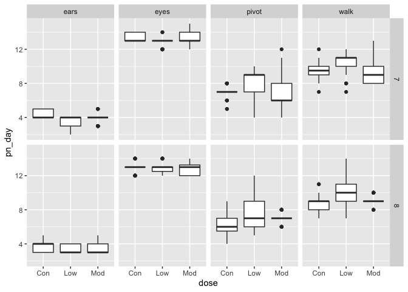<!-- -->
